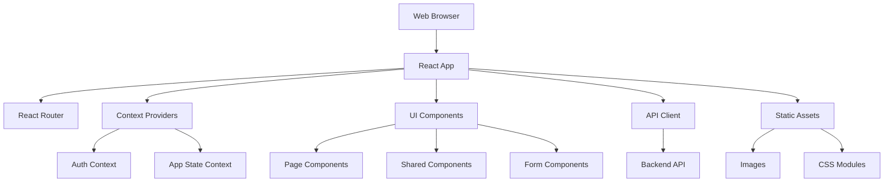
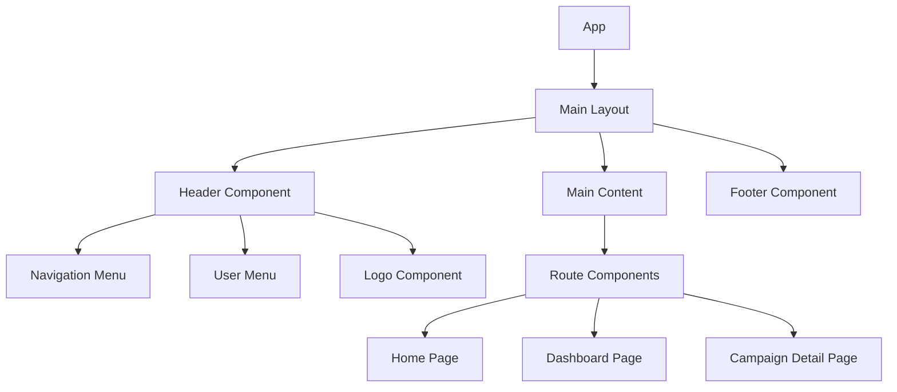

# Design Document - Sistema de Doações Frontend

## Overview

O Sistema de Doações Frontend é uma aplicação React.js moderna que fornece uma interface de usuário completa para o sistema de doações. A aplicação utiliza Vite como build tool, Context API para gerenciamento de estado, Axios para comunicação HTTP, e CSS Modules para estilização. O design segue princípios de UX/UI modernos com foco em responsividade, acessibilidade e performance.

## Architecture

### High-Level Architecture



### Technology Stack

- **Framework**: React 18 with Hooks
- **Build Tool**: Vite
- **Routing**: React Router DOM v6
- **State Management**: React Context API + useReducer
- **HTTP Client**: Axios with interceptors
- **Styling**: CSS Modules + CSS Variables
- **Form Handling**: Custom hooks + validation
- **Icons**: React Icons (Lucide React)
- **Date Handling**: date-fns
- **Development**: ESLint + Prettier

### Project Structure

```
frontend/
├── public/
│   ├── index.html
│   ├── favicon.ico
│   └── manifest.json
├── src/
│   ├── components/           # Reusable UI components
│   │   ├── common/          # Generic components
│   │   │   ├── Button/
│   │   │   ├── Input/
│   │   │   ├── Modal/
│   │   │   ├── Loading/
│   │   │   └── Notification/
│   │   ├── layout/          # Layout components
│   │   │   ├── Header/
│   │   │   ├── Footer/
│   │   │   ├── Sidebar/
│   │   │   └── Navigation/
│   │   └── features/        # Feature-specific components
│   │       ├── Campaign/
│   │       ├── Donation/
│   │       ├── Comment/
│   │       └── User/
│   ├── pages/               # Page components
│   │   ├── Home/
│   │   ├── Login/
│   │   ├── Register/
│   │   ├── Dashboard/
│   │   ├── CampaignDetail/
│   │   ├── CreateCampaign/
│   │   └── NotFound/
│   ├── contexts/            # React Context providers
│   │   ├── AuthContext.js
│   │   ├── AppContext.js
│   │   └── NotificationContext.js
│   ├── hooks/               # Custom React hooks
│   │   ├── useApi.js
│   │   ├── useAuth.js
│   │   ├── useForm.js
│   │   └── usePagination.js
│   ├── services/            # API and external services
│   │   ├── api.js
│   │   ├── authService.js
│   │   ├── campaignService.js
│   │   └── donationService.js
│   ├── utils/               # Utility functions
│   │   ├── formatters.js
│   │   ├── validators.js
│   │   ├── constants.js
│   │   └── helpers.js
│   ├── styles/              # Global styles and variables
│   │   ├── globals.css
│   │   ├── variables.css
│   │   └── reset.css
│   ├── App.js
│   ├── App.module.css
│   └── main.js
├── package.json
├── vite.config.js
├── .eslintrc.js
└── README.md
```

## Components and Interfaces

### Component Architecture

#### Layout Components



#### Feature Components Hierarchy

**Campaign Components:**
- `CampaignCard` - Display campaign summary
- `CampaignList` - List of campaigns with pagination
- `CampaignDetail` - Full campaign information
- `CampaignForm` - Create/edit campaign form
- `CampaignProgress` - Progress bar and statistics

**Donation Components:**
- `DonationForm` - Donation input form
- `DonationList` - List of donations
- `DonationCard` - Individual donation display
- `DonationSummary` - Donation statistics

**User Components:**
- `LoginForm` - User authentication form
- `RegisterForm` - User registration form
- `UserProfile` - User profile display/edit
- `UserDashboard` - User's campaigns and donations

### State Management Design

#### Context Structure

```javascript
// AuthContext - User authentication state
{
  user: {
    id: number,
    nome: string,
    email: string
  },
  token: string,
  isAuthenticated: boolean,
  isLoading: boolean
}

// AppContext - Application state
{
  campaigns: Campaign[],
  categories: Category[],
  currentCampaign: Campaign | null,
  filters: {
    category: string,
    search: string,
    status: string
  },
  pagination: {
    page: number,
    limit: number,
    total: number
  }
}

// NotificationContext - UI notifications
{
  notifications: Notification[],
  showNotification: (message, type) => void,
  removeNotification: (id) => void
}
```

#### Custom Hooks Design

**useAuth Hook:**
```javascript
const useAuth = () => {
  const login = async (email, password) => { /* ... */ };
  const register = async (userData) => { /* ... */ };
  const logout = () => { /* ... */ };
  const updateProfile = async (userData) => { /* ... */ };
  
  return { user, isAuthenticated, login, register, logout, updateProfile };
};
```

**useApi Hook:**
```javascript
const useApi = (url, options = {}) => {
  const [data, setData] = useState(null);
  const [loading, setLoading] = useState(false);
  const [error, setError] = useState(null);
  
  const execute = async (params) => { /* ... */ };
  const refetch = () => { /* ... */ };
  
  return { data, loading, error, execute, refetch };
};
```

## Data Models

### Frontend Data Interfaces

```typescript
interface User {
  id: number;
  nome: string;
  email: string;
  createdAt: string;
}

interface Category {
  id: number;
  nome: string;
  descricao: string;
}

interface Campaign {
  id: number;
  titulo: string;
  descricao: string;
  meta_arrecadacao: number;
  valor_atual: number;
  data_limite: string;
  status: 'ativa' | 'concluida' | 'cancelada';
  usuario_id: number;
  categoria_id: number;
  Usuario: User;
  Categoria: Category;
  createdAt: string;
  updatedAt: string;
}

interface Donation {
  id: number;
  valor: number;
  data: string;
  mensagem_apoio?: string;
  usuario_id: number;
  campanha_id: number;
  Usuario: User;
}

interface Comment {
  id: number;
  texto: string;
  data: string;
  usuario_id: number;
  campanha_id: number;
  Usuario: User;
}
```

### Form Validation Schemas

```javascript
// Campaign Form Validation
const campaignValidation = {
  titulo: {
    required: true,
    minLength: 5,
    maxLength: 100
  },
  descricao: {
    required: true,
    minLength: 20,
    maxLength: 1000
  },
  meta_arrecadacao: {
    required: true,
    min: 1,
    type: 'number'
  },
  data_limite: {
    required: true,
    futureDate: true
  },
  categoria_id: {
    required: true,
    type: 'number'
  }
};

// Donation Form Validation
const donationValidation = {
  valor: {
    required: true,
    min: 1,
    type: 'number',
    decimal: true
  },
  mensagem_apoio: {
    maxLength: 500
  }
};
```

## User Interface Design

### Design System

#### Color Palette
```css
:root {
  /* Primary Colors */
  --primary-50: #f0f9ff;
  --primary-500: #3b82f6;
  --primary-600: #2563eb;
  --primary-700: #1d4ed8;
  
  /* Success Colors */
  --success-50: #f0fdf4;
  --success-500: #22c55e;
  --success-600: #16a34a;
  
  /* Warning Colors */
  --warning-50: #fffbeb;
  --warning-500: #f59e0b;
  --warning-600: #d97706;
  
  /* Error Colors */
  --error-50: #fef2f2;
  --error-500: #ef4444;
  --error-600: #dc2626;
  
  /* Neutral Colors */
  --gray-50: #f9fafb;
  --gray-100: #f3f4f6;
  --gray-500: #6b7280;
  --gray-700: #374151;
  --gray-900: #111827;
}
```

#### Typography Scale
```css
:root {
  --font-family-base: 'Inter', -apple-system, BlinkMacSystemFont, sans-serif;
  
  --text-xs: 0.75rem;    /* 12px */
  --text-sm: 0.875rem;   /* 14px */
  --text-base: 1rem;     /* 16px */
  --text-lg: 1.125rem;   /* 18px */
  --text-xl: 1.25rem;    /* 20px */
  --text-2xl: 1.5rem;    /* 24px */
  --text-3xl: 1.875rem;  /* 30px */
  --text-4xl: 2.25rem;   /* 36px */
}
```

#### Spacing System
```css
:root {
  --space-1: 0.25rem;   /* 4px */
  --space-2: 0.5rem;    /* 8px */
  --space-3: 0.75rem;   /* 12px */
  --space-4: 1rem;      /* 16px */
  --space-6: 1.5rem;    /* 24px */
  --space-8: 2rem;      /* 32px */
  --space-12: 3rem;     /* 48px */
  --space-16: 4rem;     /* 64px */
}
```

### Responsive Design Strategy

#### Breakpoints
```css
:root {
  --breakpoint-sm: 640px;   /* Mobile landscape */
  --breakpoint-md: 768px;   /* Tablet */
  --breakpoint-lg: 1024px;  /* Desktop */
  --breakpoint-xl: 1280px;  /* Large desktop */
}
```

#### Layout Patterns

**Mobile-First Grid System:**
```css
.container {
  width: 100%;
  max-width: 1280px;
  margin: 0 auto;
  padding: 0 var(--space-4);
}

.grid {
  display: grid;
  gap: var(--space-4);
  grid-template-columns: 1fr;
}

@media (min-width: 768px) {
  .grid {
    grid-template-columns: repeat(2, 1fr);
  }
}

@media (min-width: 1024px) {
  .grid {
    grid-template-columns: repeat(3, 1fr);
  }
}
```

### Page Layouts

#### Homepage Layout
```mermaid
wireframe
  title Homepage Layout
  
  section Header
    Navigation | Logo | User Menu
  
  section Hero
    Search Bar
    Category Filters
  
  section Main Content
    Campaign Grid (3 columns desktop, 2 tablet, 1 mobile)
    Pagination
  
  section Footer
    Links | Contact | Social Media
```

#### Campaign Detail Layout
```mermaid
wireframe
  title Campaign Detail Layout
  
  section Header
    Navigation | Logo | User Menu
  
  section Campaign Info
    Title | Creator | Category
    Description | Progress Bar
    Goal Amount | Current Amount
  
  section Actions
    Donation Form (if authenticated)
    Share Buttons
  
  section Comments
    Comment List
    Add Comment Form (if authenticated)
```

#### Dashboard Layout
```mermaid
wireframe
  title User Dashboard Layout
  
  section Header
    Navigation | Logo | User Menu
  
  section Sidebar
    Profile Summary
    Quick Stats
    Navigation Menu
  
  section Main Content
    My Campaigns Tab
    My Donations Tab
    Profile Settings Tab
```

## API Integration

### HTTP Client Configuration

```javascript
// api.js - Axios configuration
import axios from 'axios';

const API_BASE_URL = import.meta.env.VITE_API_URL || 'http://localhost:3000/api';

const apiClient = axios.create({
  baseURL: API_BASE_URL,
  timeout: 10000,
  headers: {
    'Content-Type': 'application/json',
  },
});

// Request interceptor for auth token
apiClient.interceptors.request.use((config) => {
  const token = localStorage.getItem('authToken');
  if (token) {
    config.headers.Authorization = `Bearer ${token}`;
  }
  return config;
});

// Response interceptor for error handling
apiClient.interceptors.response.use(
  (response) => response,
  (error) => {
    if (error.response?.status === 401) {
      localStorage.removeItem('authToken');
      window.location.href = '/login';
    }
    return Promise.reject(error);
  }
);
```

### Service Layer Design

```javascript
// campaignService.js
export const campaignService = {
  getAll: (params = {}) => 
    apiClient.get('/campanhas', { params }),
  
  getById: (id) => 
    apiClient.get(`/campanhas/${id}`),
  
  create: (data) => 
    apiClient.post('/campanhas', data),
  
  update: (id, data) => 
    apiClient.put(`/campanhas/${id}`, data),
  
  delete: (id) => 
    apiClient.delete(`/campanhas/${id}`),
  
  getDonations: (id) => 
    apiClient.get(`/campanhas/${id}/doacoes`),
  
  getComments: (id) => 
    apiClient.get(`/campanhas/${id}/comentarios`)
};
```

## Error Handling

### Error Boundary Implementation

```javascript
class ErrorBoundary extends React.Component {
  constructor(props) {
    super(props);
    this.state = { hasError: false, error: null };
  }

  static getDerivedStateFromError(error) {
    return { hasError: true, error };
  }

  componentDidCatch(error, errorInfo) {
    console.error('Error caught by boundary:', error, errorInfo);
  }

  render() {
    if (this.state.hasError) {
      return <ErrorFallback error={this.state.error} />;
    }
    return this.props.children;
  }
}
```

### API Error Handling Strategy

```javascript
const handleApiError = (error) => {
  const defaultMessage = 'Ocorreu um erro inesperado. Tente novamente.';
  
  if (!error.response) {
    return 'Erro de conexão. Verifique sua internet.';
  }
  
  const { status, data } = error.response;
  
  switch (status) {
    case 400:
      return data.message || 'Dados inválidos fornecidos.';
    case 401:
      return 'Sessão expirada. Faça login novamente.';
    case 403:
      return 'Você não tem permissão para esta ação.';
    case 404:
      return 'Recurso não encontrado.';
    case 409:
      return data.message || 'Conflito de dados.';
    case 500:
      return 'Erro interno do servidor. Tente novamente mais tarde.';
    default:
      return defaultMessage;
  }
};
```

## Performance Optimization

### Code Splitting Strategy

```javascript
// Lazy loading for route components
const HomePage = lazy(() => import('./pages/Home/HomePage'));
const Dashboard = lazy(() => import('./pages/Dashboard/Dashboard'));
const CampaignDetail = lazy(() => import('./pages/CampaignDetail/CampaignDetail'));

// Route configuration with Suspense
<Suspense fallback={<LoadingSpinner />}>
  <Routes>
    <Route path="/" element={<HomePage />} />
    <Route path="/dashboard" element={<Dashboard />} />
    <Route path="/campanha/:id" element={<CampaignDetail />} />
  </Routes>
</Suspense>
```

### Image Optimization

```javascript
// Responsive image component
const ResponsiveImage = ({ src, alt, className }) => {
  const [loading, setLoading] = useState(true);
  const [error, setError] = useState(false);

  return (
    <div className={`image-container ${className}`}>
      {loading && <ImageSkeleton />}
       setLoading(false)}
        onError={() => setError(true)}
        style={{ display: loading ? 'none' : 'block' }}
      />
      {error && <ImagePlaceholder />}
    </div>
  );
};
```

### Memoization Strategy

```javascript
// Memoized campaign card component
const CampaignCard = memo(({ campaign, onDonate }) => {
  const progressPercentage = useMemo(() => 
    (campaign.valor_atual / campaign.meta_arrecadacao) * 100,
    [campaign.valor_atual, campaign.meta_arrecadacao]
  );

  return (
    <div className={styles.campaignCard}>
      {/* Campaign card content */}
    </div>
  );
});
```

## Testing Strategy

### Component Testing Approach

```javascript
// Example component test
import { render, screen, fireEvent } from '@testing-library/react';
import { CampaignCard } from './CampaignCard';

describe('CampaignCard', () => {
  const mockCampaign = {
    id: 1,
    titulo: 'Test Campaign',
    meta_arrecadacao: 1000,
    valor_atual: 500,
    Usuario: { nome: 'Test User' }
  };

  it('displays campaign information correctly', () => {
    render(<CampaignCard campaign={mockCampaign} />);
    
    expect(screen.getByText('Test Campaign')).toBeInTheDocument();
    expect(screen.getByText('Test User')).toBeInTheDocument();
    expect(screen.getByText('50%')).toBeInTheDocument();
  });

  it('calls onDonate when donate button is clicked', () => {
    const mockOnDonate = jest.fn();
    render(<CampaignCard campaign={mockCampaign} onDonate={mockOnDonate} />);
    
    fireEvent.click(screen.getByText('Doar'));
    expect(mockOnDonate).toHaveBeenCalledWith(mockCampaign.id);
  });
});
```

### Integration Testing

```javascript
// API integration test
import { campaignService } from '../services/campaignService';

describe('Campaign Service', () => {
  it('fetches campaigns successfully', async () => {
    const campaigns = await campaignService.getAll();
    expect(campaigns.data).toBeInstanceOf(Array);
  });

  it('creates campaign with valid data', async () => {
    const campaignData = {
      titulo: 'New Campaign',
      descricao: 'Campaign description',
      meta_arrecadacao: 1000,
      data_limite: '2024-12-31',
      categoria_id: 1
    };

    const response = await campaignService.create(campaignData);
    expect(response.status).toBe(201);
    expect(response.data.titulo).toBe(campaignData.titulo);
  });
});
```

## Security Considerations

### Authentication Security

```javascript
// Secure token storage and management
const authService = {
  setToken: (token) => {
    localStorage.setItem('authToken', token);
    // Set token expiration check
    const payload = JSON.parse(atob(token.split('.')[1]));
    const expirationTime = payload.exp * 1000;
    setTimeout(() => {
      authService.logout();
    }, expirationTime - Date.now());
  },

  getToken: () => {
    const token = localStorage.getItem('authToken');
    if (token) {
      const payload = JSON.parse(atob(token.split('.')[1]));
      if (payload.exp * 1000 < Date.now()) {
        authService.logout();
        return null;
      }
    }
    return token;
  },

  logout: () => {
    localStorage.removeItem('authToken');
    window.location.href = '/login';
  }
};
```

### Input Sanitization

```javascript
// XSS prevention utilities
export const sanitizeInput = (input) => {
  return input
    .replace(/</g, '&lt;')
    .replace(/>/g, '&gt;')
    .replace(/"/g, '&quot;')
    .replace(/'/g, '&#x27;')
    .replace(/\//g, '&#x2F;');
};

// Safe HTML rendering for user content
export const SafeHTML = ({ content }) => {
  const sanitizedContent = DOMPurify.sanitize(content);
  return <div dangerouslySetInnerHTML={{ __html: sanitizedContent }} />;
};
```

## Deployment Configuration

### Build Configuration

```javascript
// vite.config.js
import { defineConfig } from 'vite';
import react from '@vitejs/plugin-react';

export default defineConfig({
  plugins: [react()],
  build: {
    outDir: 'dist',
    sourcemap: false,
    rollupOptions: {
      output: {
        manualChunks: {
          vendor: ['react', 'react-dom'],
          router: ['react-router-dom'],
          utils: ['axios', 'date-fns']
        }
      }
    }
  },
  server: {
    port: 5173,
    proxy: {
      '/api': {
        target: 'http://localhost:3000',
        changeOrigin: true
      }
    }
  }
});
```

### Environment Configuration

```javascript
// Environment variables
VITE_API_URL=http://localhost:3000/api
VITE_APP_NAME=Sistema de Doações
VITE_APP_VERSION=1.0.0
```

### Production Optimizations

- Bundle splitting for better caching
- Image optimization and lazy loading
- Service worker for offline functionality
- CDN integration for static assets
- Gzip compression for smaller bundle sizes
- Progressive Web App (PWA) features